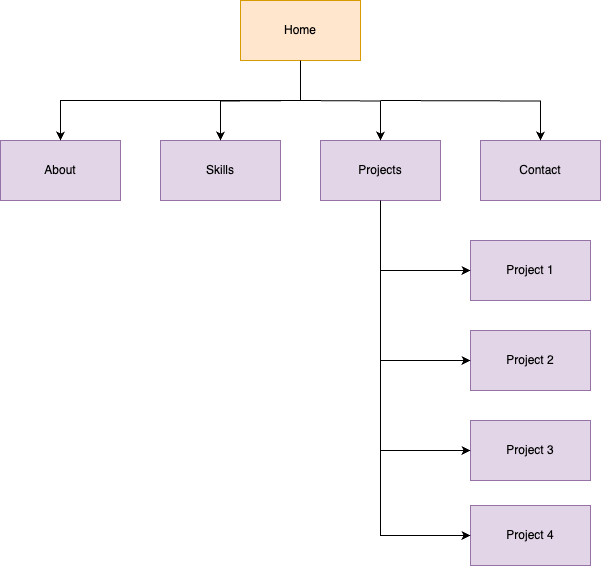
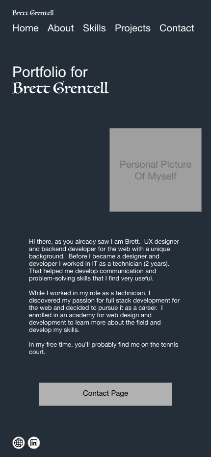
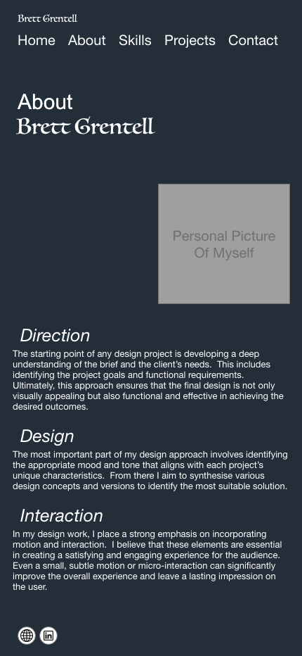
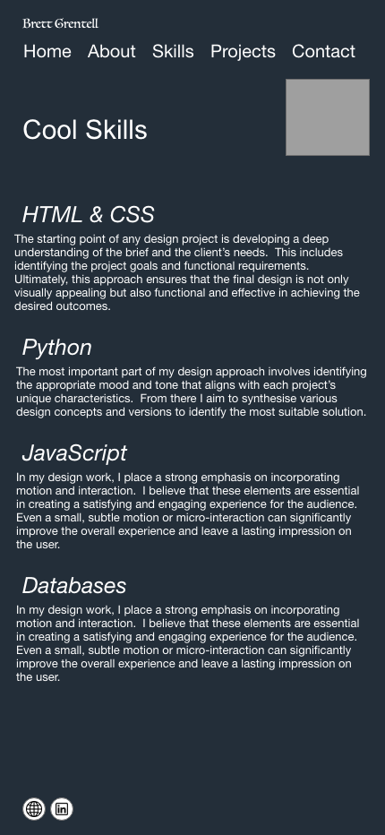
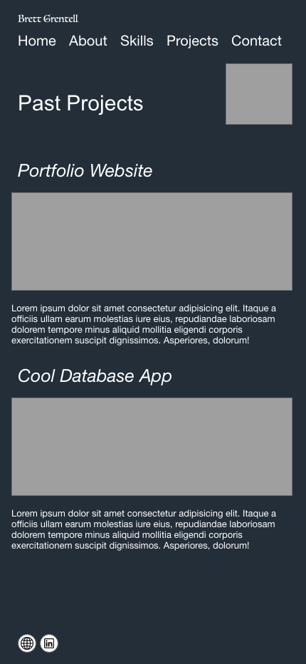
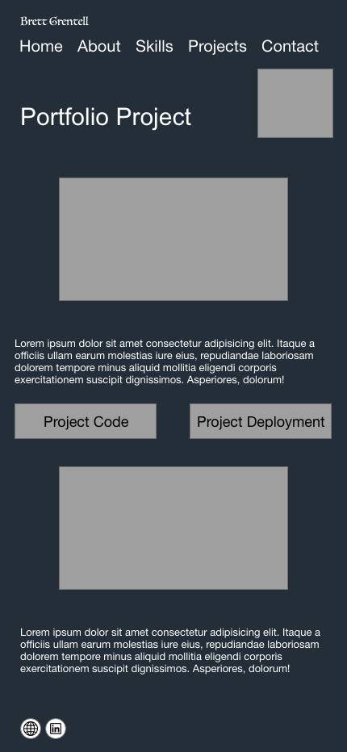
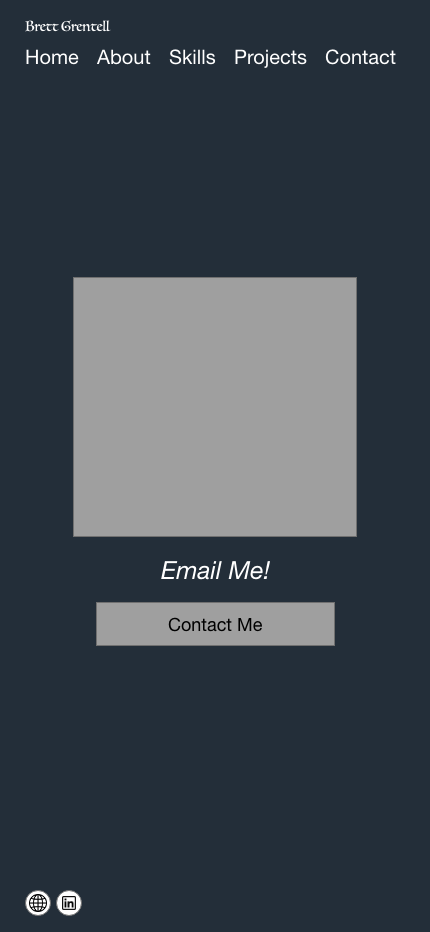

**Portfolio README for Brett Grentell**

GitHub: [https://github.com/bgrentell/portfolio](https://github.com/bgrentell/portfolio)
Website URL: [http://www.grentell.com](http://www.grentell.com)

*Purpose*

This portfolio is to showcase my skills, attributes and history for the job placements I have had, and past projects that I have attempted and/or succeeded in.

*Functionality/Features*

The website requires documentation of the historical nature of my career be displayed, with more detailed information being downloadable as a resume in pdf format.

The site should display menu options for accessing the different pages of the site, including the home page, about page, skills, blog and contact pages.

There needs to be basic animations applied to some elements, such as hyperlink hovering and blog selection.

*Screenshots*

*Sitemap*

*Website Mockup*

Home Page

About Page

Skills Page

Past Projects

Project Page

Contact Page

*Target Audience*

The website is aimed at prospective employers.  HR staff, managers of employees and business owners may be interested in a showcase of abilities and skills that are needed for placement with their company.

*Tech Stack*

For the website, the current tech stack includes a development environment and a production environment.  The development environment utilises a simple live server to test the website.  No other runtimes were used to make the website, however, visual studio code was used as the IDE, along with languages used including html, and css.

In the production environment, netlify was used as the server for running the website.  This included just what was needed for html documents along with css.  Also, a domain name was registered prior to development.  This requires a DNS server to point to the netlify website location.
